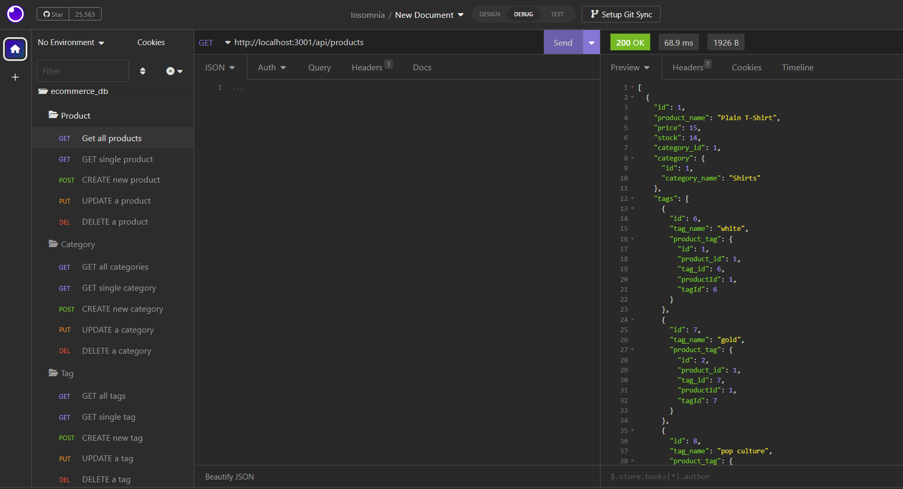
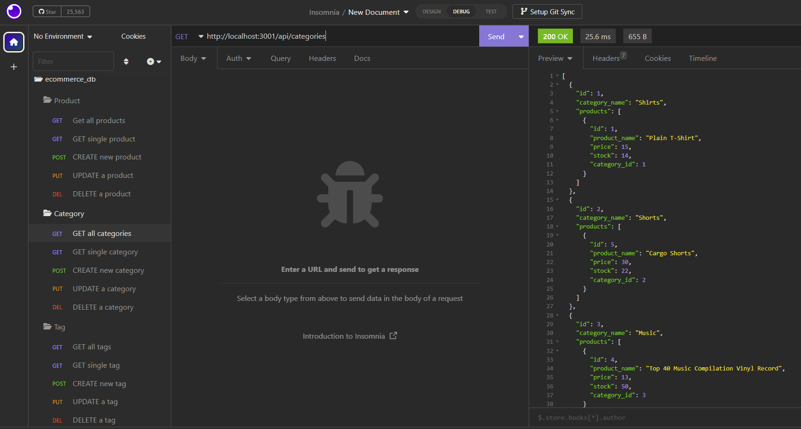
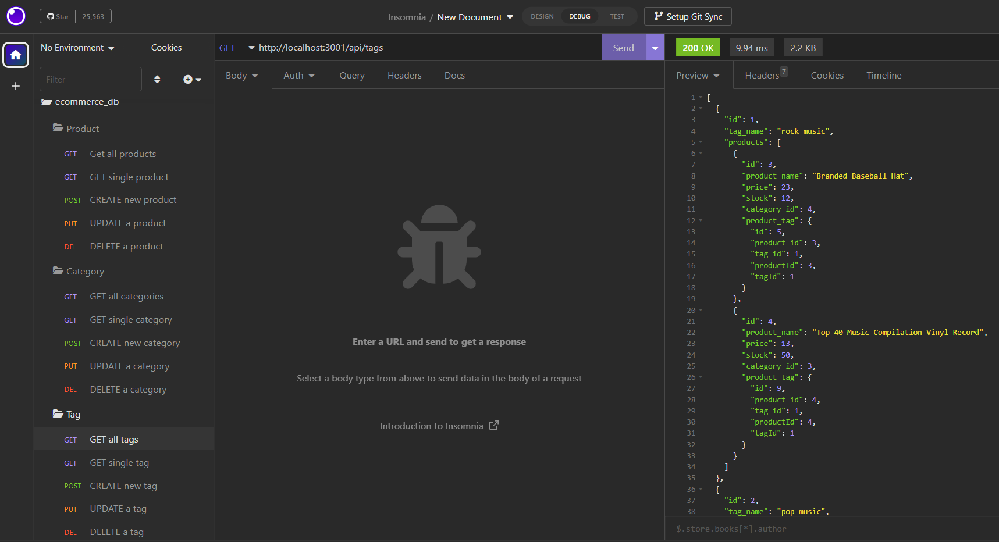

# E-Commerce

## Technologies


## Table of Contents  
-[Project Description](#description)  
-[Installation](#installation)  
-[User Story](#user-story)  
-[Acceptance Criteria](#acceptance-criteria)  
-[Mock Up](#mock-up)  
-[Contributions](#contributions)       
-[License](#license)   

## Description

This application functions as an example the back end for an e-commerce site.

## Installation
***Requirments***

[Node.js](https://nodejs.org/en/) | [Inquirer](https://www.npmjs.com/package/inquirer) | [MySQL](https://www.npmjs.com/package/mysql2)

***Once Installed:***

1. Clone the Repository on to your machine.
2. Open the terminal and ensure you are in the right file path.
3. Run the command ```npm i``` to download the packages.
4. Then run the command ```npm start``` to run the application.

## User Story
```
AS A manager at an internet retail company
I WANT a back end for my e-commerce website that uses the latest technologies
SO THAT my company can compete with other e-commerce companies  
```

## Acceptance Criteria
```
GIVEN a functional Express.js API
WHEN I add my database name, MySQL username, and MySQL password to an environment variable file
THEN I am able to connect to a database using Sequelize
WHEN I enter schema and seed commands
THEN a development database is created and is seeded with test data
WHEN I enter the command to invoke the application
THEN my server is started and the Sequelize models are synced to the MySQL database
WHEN I open API GET routes in Insomnia Core for categories, products, or tags
THEN the data for each of these routes is displayed in a formatted JSON
WHEN I test API POST, PUT, and DELETE routes in Insomnia Core
THEN I am able to successfully create, update, and delete data in my database
```

## Mock Up

#### GET all products


#### GET all categories


#### GET all tags


## Walkthrough

https://watch.screencastify.com/v/qKJXOlk3YIxhWf2csmbGhttps://watch.screencastify.com/v/qKJXOlk3YIxhWf2csmbG

## Contributions

Starter Code: https://github.com/coding-boot-camp/fantastic-umbrella

## License


